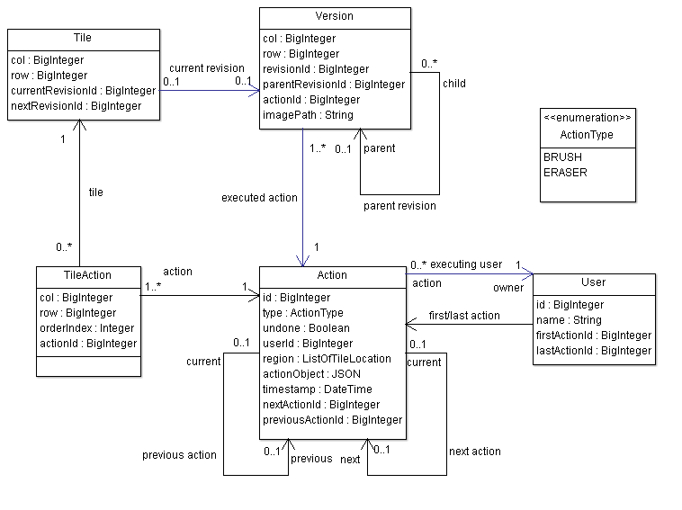
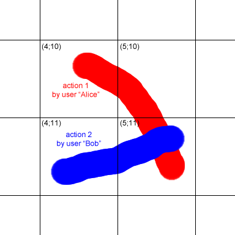
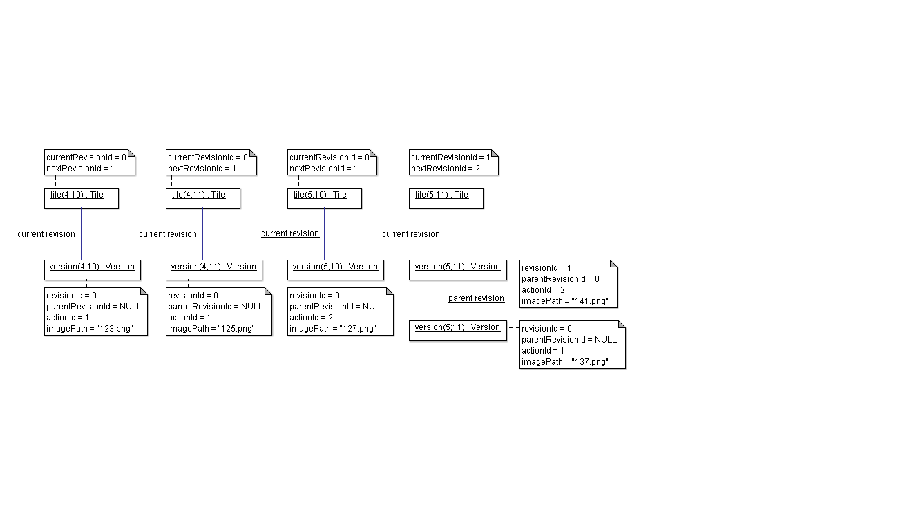

# DESIGN DECISIONS

## First big questions

### Why "big-canvas" is built for node.js?
I wanted a homogenous system (same programming language on client and server side). One can reuse code on both sides.
E.g. the HTML5 Canvas component: it can be used in the browser and on the server with the "node-canvas" module. So canvas-related code can be reused.
Beside the homogeneity I love javascript :D.

### Why it uses big integers?
I wanted a inifinite canvas in all four directions. And I never want to run out of indices. The Javascript data type "Number" is limited, "big-integer" is not.

### Why it uses MySQL as DMBS?
A brush stroke does many changes to the entities of "big-canvas", e.g. add a new action object, update the affected tile objects and set the last action of the executing user. A all-or-nothing-policy is needed. Transactions are the solution. MySQL provides transactions and node.js supports MySQL transactions with the "node-mysql" and "node-mysql-queues" modules.

### Why it uses its own remote procedure call (RPC) protocol?
I am using web sockets for the communication between client and server. The different messages between client and server had a common format. So I decided to use a remote procdure call protocol. But the existing ones were not sufficient or too redundant in their description. Shorter is nicer. So I wrote an own data and interface definition language (I love to write parsers, especially with PEG.js ^.^). See "/rpc/big-canvas.types" for the RPC definitions of "big-canvas".

TODO link to "big-canvas.types" and "json-rpc" project

## Definitions
"big-canvas" uses several concepts and objects which I will define in this section.

### Points
The canvas consists of pixels, each addressable by its coordinates (short: a *point*).

### Tiles
A square of 128x128 pixels is called a *tile*. The *tile size* is set to 128 pixels (default, adjustable in the **Config.js**). A tile is the smallest chunk of canvas where an action can be flipped to "undone".

Each tile is adressable by its *tile location*, which consists of a column index and a row index. The tile location is computed by dividing the coordinate of the top-left point with the tile size. 

### Actions
An *action* is a user command like a brush stroke or an undo. All drawing actions like "brush" and "eraser" are saved in the database with their stroke data (width, color, opacity, coordinates trace), a timestamp, the ID of the executing user and history information for the UNDO/REDO feature.

Actions like UNDO and REDO will not be saved in the database. These actions flip an "undone"-flag of the affected drawing action.

All saved actions get a unique id, called *ActionId*. It is represented by the "BigInteger" data type (see above).

### Sessions
*Sessions* are introduced by a session ID cookie. Each session is assigned to an user. If the session was open the first time, the user will be generated with a random insult for the name. Why an insult? I thought that would be funny and a motivation for the user to rename himself.

### Users
A *User* is defined by his unique ID called *UserId* (BigInteger) and his name. The name can be chosen by the user.

The user is bound to history data for the UNDO/REDO feature. A user has pointers to its last and its first action.

### Window
A client (and the associated user) can move on the canvas. The server needs the information about the client's position and view size to send new updates of tiles and about user activities. The position and size is called the *window* of the client/user. (One could send all updates to all users, but that is not efficient enough ;-)).

## Data model
The following diagram shows which data is held by big-canvas and how the data entites are connected to each other. Basicly we have tiles, versions, actions and users:

Each tile is defined by its tile location (column and row) and points to the last valid version. A version belongs always to a tile (same tile location). Versions are defined by their revision id and an action id and they point to a parent revision. A version is the result of applying this action to the parent version. The next new revision id is held in the tile object with the same location. Every version has a path to its image. If the path is null, the version has to be drawn by a so called "render job".

An action is a command executed by a user applied to the canvas. Its type determines whether it is a brush or eraser command. The "actionObject" holds the original sent action string. The region tells us which tile locations are affected. And last but not least there are pointers to the previous and the next action (of the executing user!). They are used to realize the undo/redo functionality.

##Example
Imagine Alice is doing a brush action from tile (4;10), over (5;10) to (5;11). Afterwars Bob is also performing a brush action from tile (4;11) to (5;11).

The following image shows which values the objects have and how they are connected. There are four tile objects, each with at least one version.
