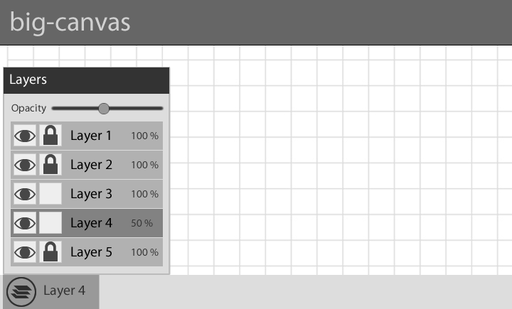

# GUI

## Read-only mode
* [Muro](http://muro.deviantart.com/)

### User
  * name (get/set)
  * email?

### Comments
  * for each layer or global?
  * comments have a layer attribute, which can be null for global comments
  * private attribute, only the painter and the commentator can see the comment
  * like functionality
  * markers like in google maps
  * comments in a collapsable sidebar
  * answer functionality

### Layers
 * (move to edit mode?)
 * lock
 * visible
 * opacity
 * fixed id color?

### Main menu?
 * file
 * edit
 * contact
 * help

### Library?
 * uploaded images
 * live images
 * static images
 * canvas sites (read-only links)
 * storyboards?
  
## Edit mode (extended read-only mode)

### Tools
 * brush
 * eraser
 * undo
 * redo
 * move
 * (select mask)
 * (cut)
 * (copy)
 * (paste)
 * (eye dropper)
 * Tool preview, see Muro
 * opacity trackbar
 * softness trackbar
 * size trackbar
 * helper lines
  
### Color picker
* [RGB/HSB](http://www.colorpicker.com/)
  * add to palette
  * generate schemes
* [HSL](http://hslpicker.com/)
* [CMYK](http://colorizer.org/)
* [Conversion formulas](http://www.easyrgb.com/index.php?X=MATH)
* [Hexagon palette](http://www.w3schools.com/tags/ref_colormixer.asp)